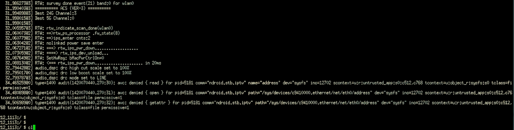

### NetTV Custom App Installation via Serial Port

#### Requirements

##### Hardware

1. USB 2.0 to TTL UART Module [CP2102]
2. Jumper Cables

##### Software

1. Terminal Emulator [PuTTY, screen, minicom]

A serial port is a serial communication interface through which information transfers in or out sequentially one bit at a time. Server computers may use a serial port as a control console for diagnostics, while networking hardware (such as routers and switches) commonly use serial console ports for configuration, diagnostics, and emergency maintenance access. To interface with these and other devices, USB-to-serial converters can quickly and easily add a serial port to a modern PC.


Most microcontrollers these days have built in UARTs (universally asynchronous receiver/transmitter) that can be used to receive and transmit data serially. UARTs transmit one bit at a time at a specified data rate (i.e. 9600bps, 115200bps, etc.). This method of serial communication is sometimes referred to as TTL serial (transistor-transistor logic). Serial communication at a TTL level will always remain between the limits of 0V and Vcc, which is often 5V or 3.3V. A logic high ('1') is represented by Vcc, while a logic low ('0') is 0V.


| CP2102                         | Wiring                      | Wiring & Hardware                        |
| ------------------------------ | --------------------------- | ---------------------------------------- |
|  |  |  |

#### 1. Launch PuTTY in GUI mode as sudo

```
sudo putty
```

#### 2.Configure PuTTY

1. `/dev/ttyUSB0` serial device, in my case a USB to UART adapter which was enumerated by my machine as USB0
2. Use serial mode, not SSH or Telnet modes
3. Use proper serial configuration (explained below)

| Setting Name | Value  |
| ------------ | ------ |
| Baud rate    | 115200 |
| Data bits    | 8      |
| Parity       | None   |
| Stop Bits    | 1      |
| Flow Control | None   |


#### 3.Shell go brrrrr



#### 4. Install apps

Load a USB drive with the apk file of the app (eg: Reddit.apk), connect the drive to the USB port of the NetTV box and install from the shell.

```
cd /mnt/media_rw/7299-1B46/
```


```
pm install Reddit.apk
```


#### 5. Result


